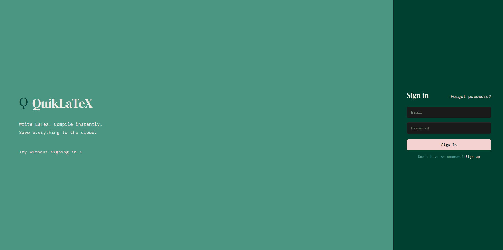

# QuikLaTeX

A full-stack LaTeX editor with real-time PDF compilation, cloud document storage, and user authentication. Built as a progression from a vanilla JS prototype to a production React application.

**Site URL:** [quiklatex.vercel.app](https://quiklatex.vercel.app)

---

## Features

- **Instant PDF compilation** — write LaTeX and compile to a rendered PDF preview in the browser
- **Cloud document storage** — documents are automatically saved to the cloud every 2 seconds
- **User authentication** — sign up, sign in, and password recovery via Supabase Auth
- **Document dashboard** — manage all your documents with last-edited timestamps and inline renaming
- **Guest mode** — try the editor without creating an account
- **Import / Export** — import `.tex` files and export documents as `.tex` or `.pdf`

---

## Tech Stack

**Frontend**
- React + Vite
- React Router
- PDF.js
- Supabase JS client

**Backend**
- Node.js + Express
- pdflatex (via TeX Live)
- Docker

**Infrastructure**
- Vercel (frontend)
- Railway (backend)
- Supabase (database + authentication)

---

## Demo

---
